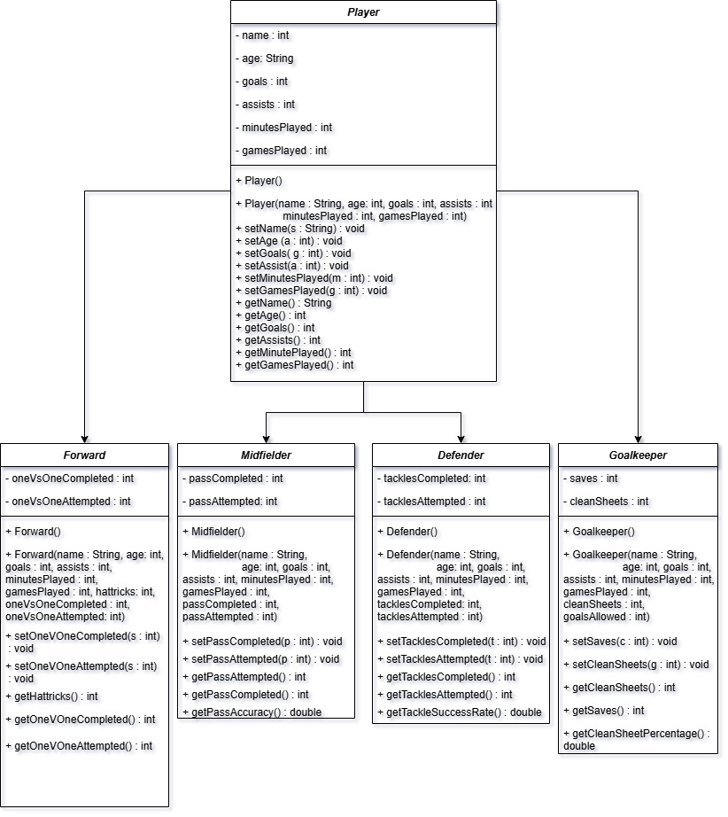

# Soccer Stats Tracker

Java application for registering soccer players and tracking position-specific performance statistics.

The program uses object-oriented programming concepts such as inheritance and polymorphism to represent forwards, midfielders, defenders, and goalkeepers with different statistics tailored to each position. 
## Features

- Register players by position
- Store player information including:
    - Name
    - Age
    - Goals
    - Assists
    - Minutes played
    - Games played
- Track position-specific statistics:
  - **Forward:** 1v1 attempts, completions, and success rate
  - **Midfielder:** passes attempted, completed, and pass accuracy
  - **Defender:** tackles attempted, completed, and tackle success rate
  - **Goalkeeper:** saves, clean sheets, and clean sheet percentage
- View previously registered players and their statistics
- Input validation and exception handling

## UML Diagram

## Running the Project

1. Clone the repository.
2. Open the project in a Java IDE.
3. Run `SoccerStatsTracker.java`.
4. Enjoy!

Originally created as a Java course project for CIS-166 and later cleaned + documented for my software engineering portfolio.